# 📒 Vi-Notes

Vi-Notes is a full-stack web application for creating, managing, and organizing notes efficiently. It provides a smooth user experience with authentication, note management, and a modern UI.

---

## Tech Stack

### Frontend
- React (Vite + TypeScript)
- Tailwind CSS
- Axios
- React Router
- Framer Motion

### Backend
- Node.js
- Express.js
- MongoDB (Mongoose)
- TypeScript
- JWT Authentication
- bcrypt (for password hashing)

---

## Features

- 🔐 User Authentication (Login / Register)
- 📝 Create, Update, Delete Notes
- 📊 Data visualization (charts using Recharts/D3)
- 📄 Export notes as PDF
- 🎨 Smooth UI with animations
- 🌐 REST API integration

---

## Installation & Setup

### Clone the Repository

git clone <your-repo-url>  
cd Vi-Notes  

---

## Running the Project

### 🔹 Step 1: Setup Backend

cd backend  
npm install  

#### Create `.env` file inside backend folder:

PORT=5000  
MONGO_URI=your_mongodb_connection_string  
JWT_SECRET=your_secret_key  

#### Run Backend:

npm run dev  

Backend will run on:  
http://localhost:5000  

---

### 🔹 Step 2: Setup Frontend

Open a new terminal:

cd frontend  
npm install  

#### Run Frontend:

npm run dev  

Frontend will run on:  
http://localhost:5173  

---

## API Endpoints

### Auth Routes (`/api/auth`)

| Method | Endpoint              | Description        |
|--------|----------------------|--------------------|
| POST   | /api/auth/register   | Register user      |
| POST   | /api/auth/login      | Login user         |

---

### User Routes (`/api/user`)

| Method | Endpoint                    | Description            |
|--------|----------------------------|------------------------|
| GET    | /api/user/profile          | Get user profile       |
| PUT    | /api/user/profile          | Update user profile    |
| PUT    | /api/user/reset-password   | Reset password         |
| GET    | /api/user/dashboard        | Get dashboard data     |

---

### Contact Routes (`/api/contact`)

| Method | Endpoint          | Description              |
|--------|------------------|--------------------------|
| POST   | /api/contact     | Send contact message     |

---

### Session Routes (`/api/session`)

| Method | Endpoint                     | Description              |
|--------|-----------------------------|--------------------------|
| GET    | /api/session                | Get all sessions         |
| POST   | /api/session                | Create session           |
| PUT    | /api/session/:id            | Update session           |
| POST   | /api/session/submit         | Submit session           |
| DELETE | /api/session/:sessionId     | Delete session           |

---

## Build for Production

Frontend:  
npm run build  

Backend:  
npm run dev  

---

## Future Improvements

- Dark Mode
- Note sharing feature
- Search & filter notes

---

## Demo Preview

### Main Page
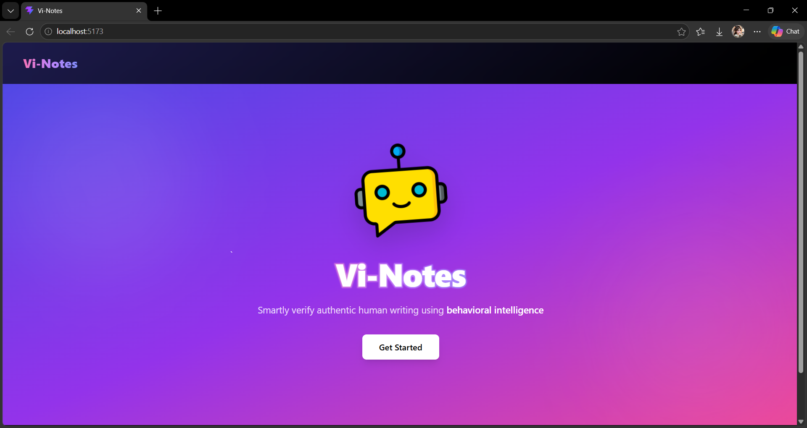

### Register Page
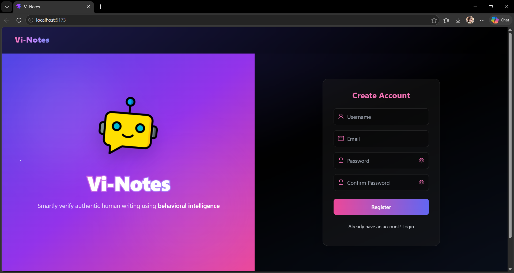

### Home Page
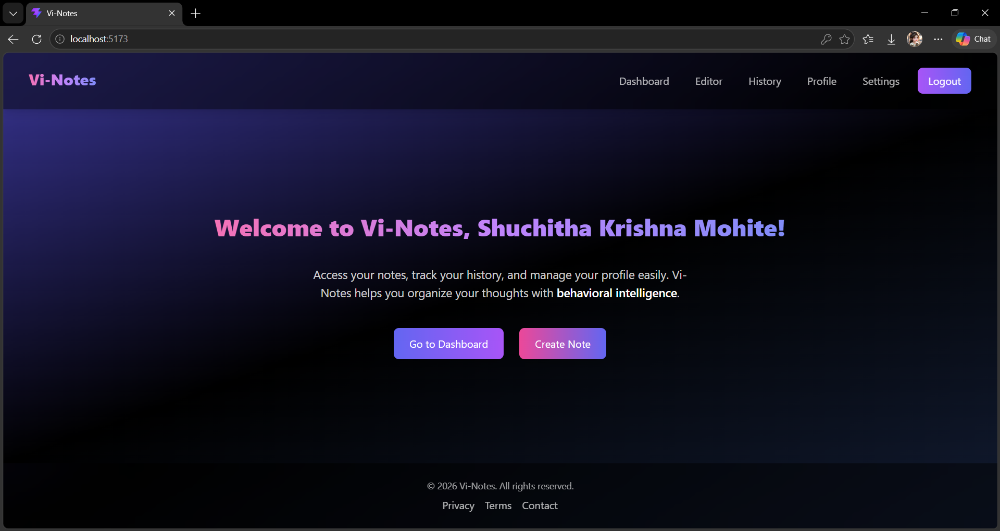

### Editor Page
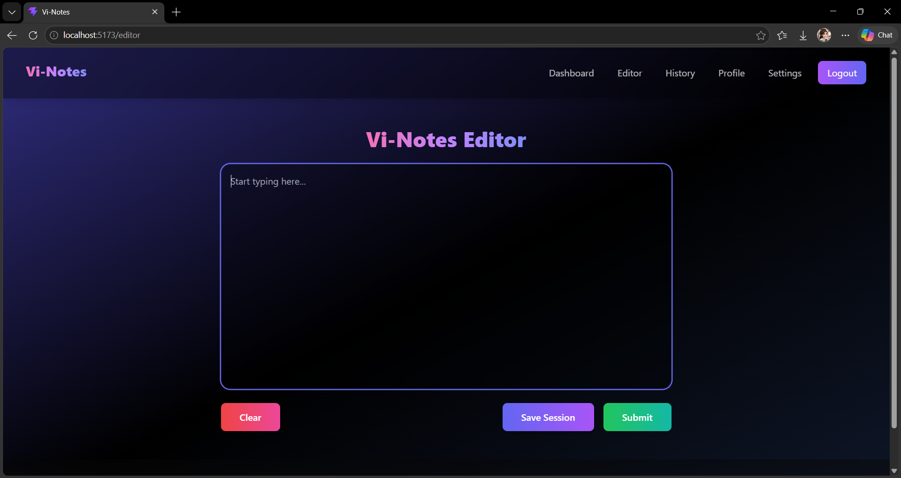

### Detection
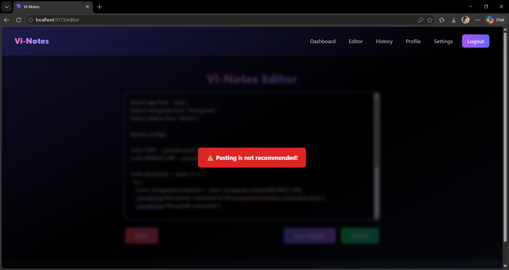

### Dashboard Page
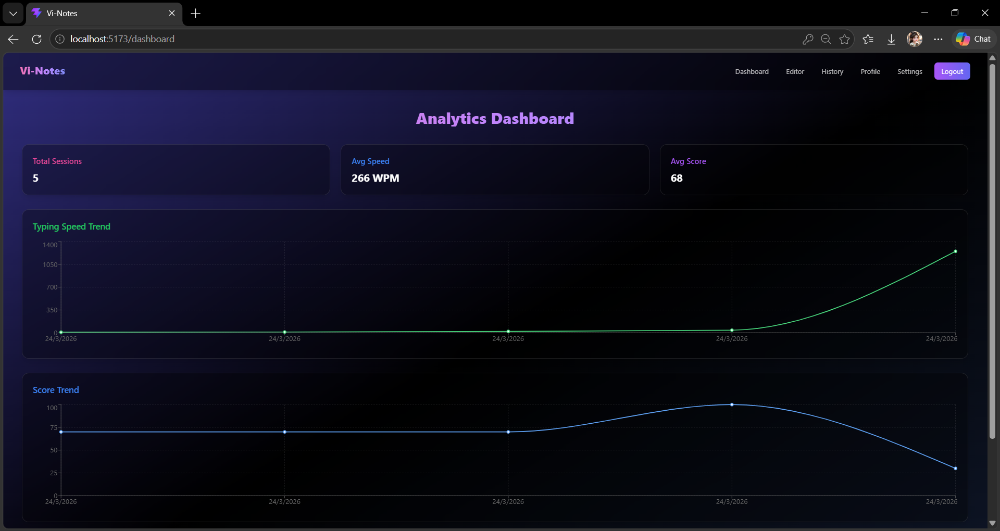

### History Page
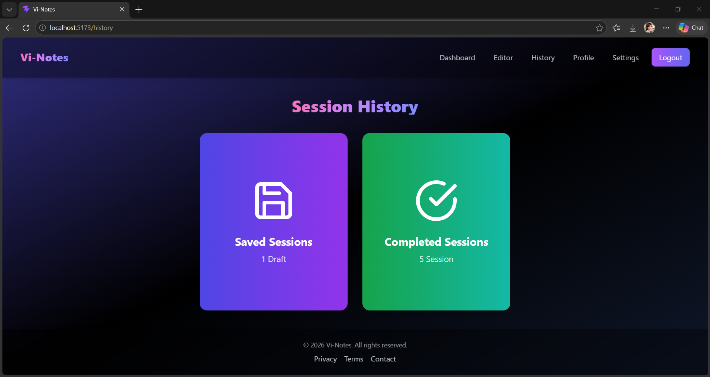

### Completed Session Page
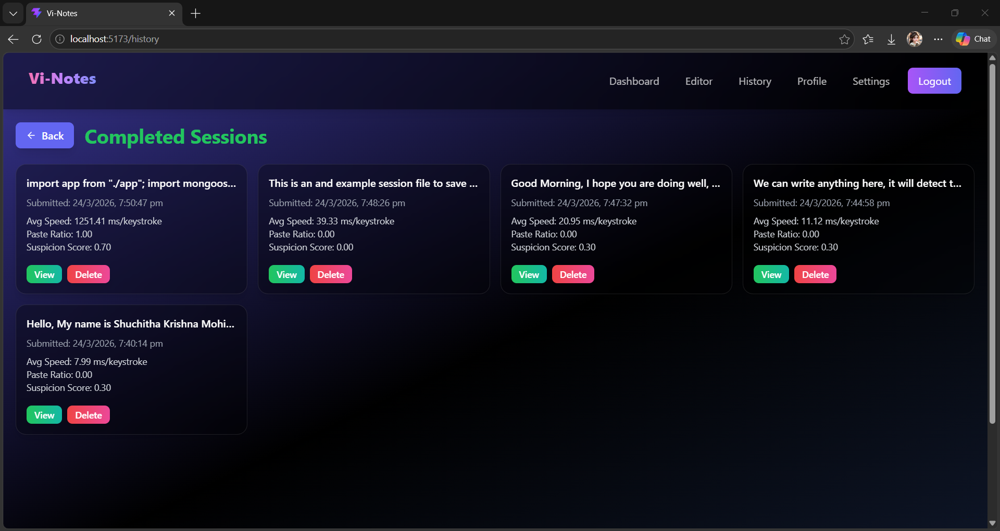

### Downloaded PDF Page
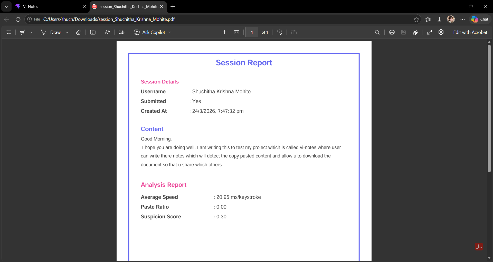

### Profile Page
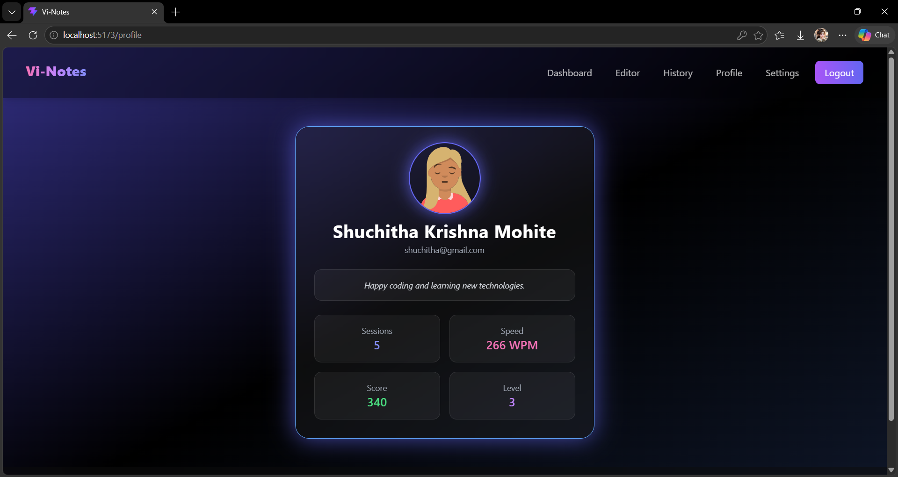

### Edit Profile Page
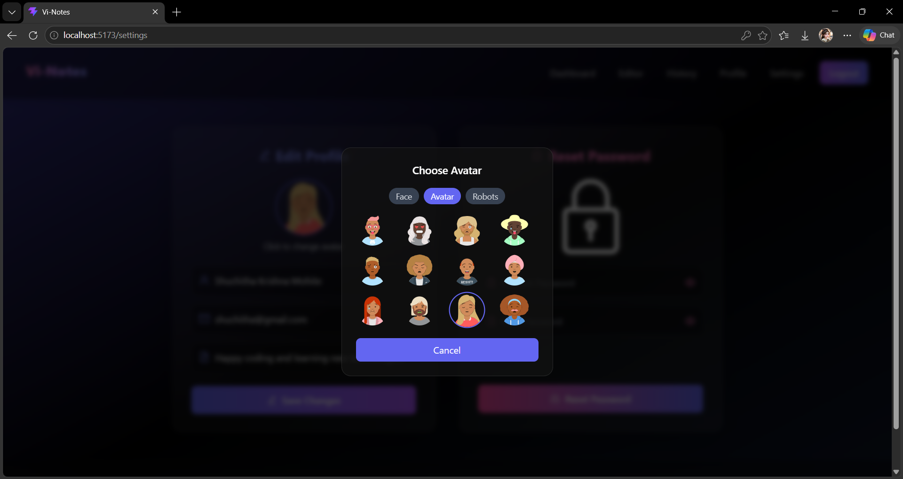

### Settings Page
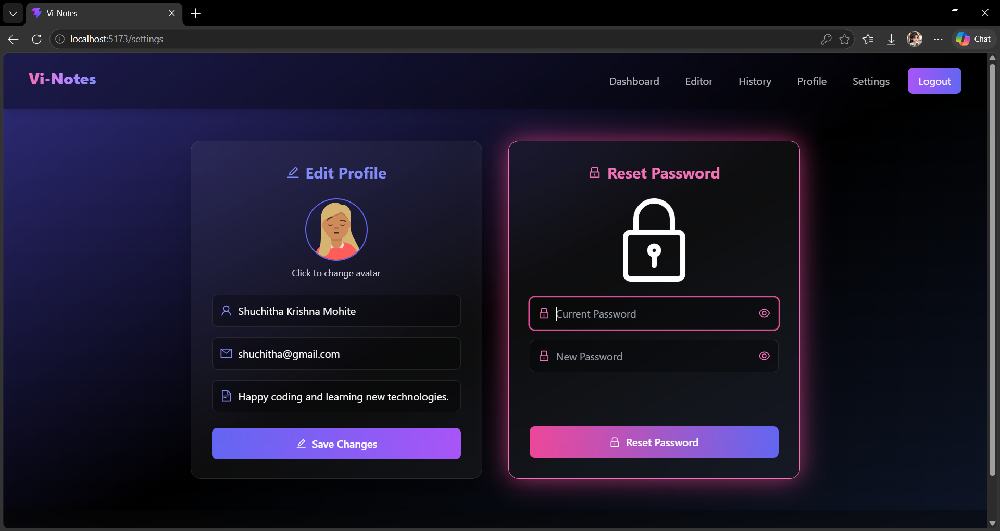

### Terms Page
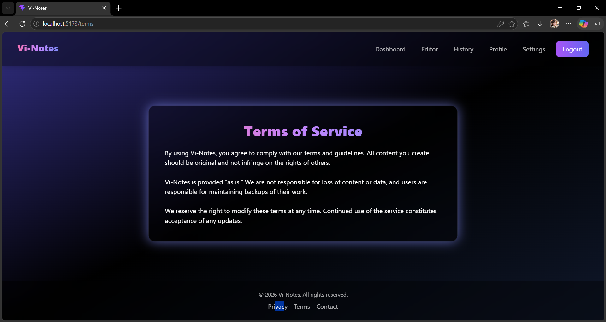

### Contact Page
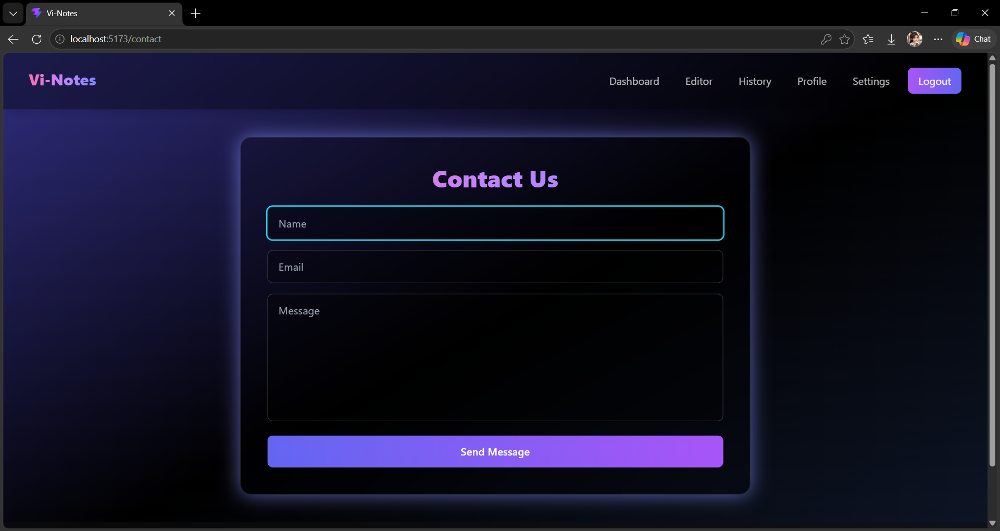